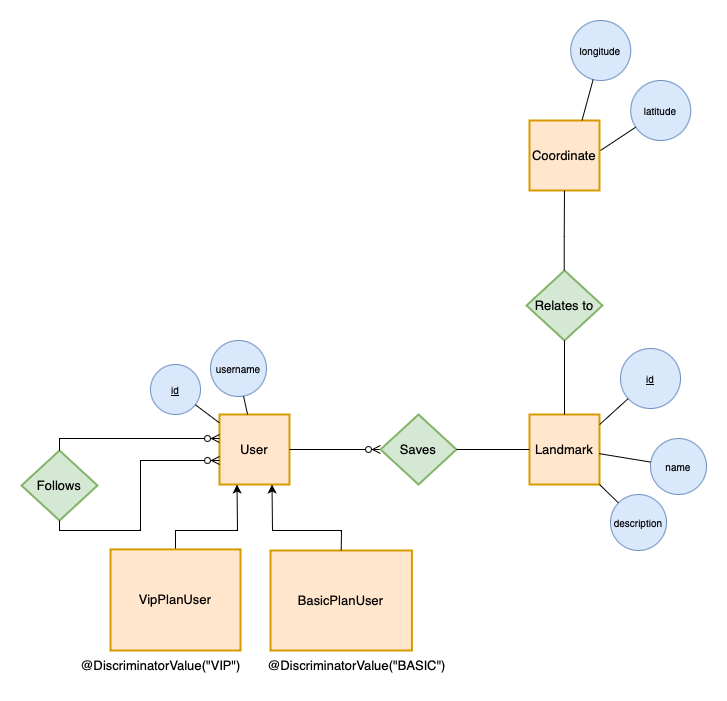

# Assignent 3 - Landmarks

**GitLab Repository**: [https://gitlab.com/bicocca_projects/2023_assignment3_landmarks](https://gitlab.com/bicocca_projects/2023_assignment3_landmarks)

**Group components**:  {givenName} {familyName} - {badgeNumber}:

- Nicol Emanuele - 919020
- Nicolas Guarini -  918670

## Project Description
This project focuses on developing the backend of a social application for saving points of interest (*landmarks*) around the world.
Each user can save points of interest which include the coordinates (latitude, longitude, altitude), a name, and the description relating to that point.
A user can also "follow" other users, in order to see (via an hypothetical frontend which can be a web app or a mobile app) the points of interest that they save at any time. 
Users are divided into Basic and VIP. Basic users have a limit of 10 landmarks saves, while VIPs have unlimited saves.

At the implementation level, [JPA](https://en.wikipedia.org/wiki/Jakarta_Persistence) and [Hibernate](https://hibernate.org/) was used to manage synchronization and mapping with the PostgreSQL database, while the [Spark](https://sparkjava.com/) framework was used to manage the API endpoints, which allows fast and functional management of the endpoints and their handlers.

### ER Diagram
We have these entities:
- User
- BasicPlanUser
- VipPlanUser
- Landmark
- Coordinate

and three relations:
- "follows": Many-to-Many, self-loop on User entity;
- "relates to": One-to-One, between Landmark and Coordinate;
- "saves": One-to-Many, between User and Landmark.



NB: The User entity (but generally the other entities as well) has been kept as minimal as possible at the attribute level, so that the whole thing can be integrated into a larger, possibly existing system.

## Project Structure
In the root of the source code folder (`src/main/java/bicocca2023/assignment3/`), in addition to the `Main` class (application entry point), which simply initializes the server and endpoints on port 8000, we have the `Routes` class, which defines all the endpoints and related handlers that will handle HTTP requests and responses.

The application source code is structured in the following packages:

- **`controller`**: Controllers handle incoming HTTP requests, process them, and provide an appropriate response. They act as an intermediary between the client (who made the request) and the application's business logic (Service classes);


- **`service`**: Services contain the business logic of the application. They act as an intermediary between controllers and repositories, handling complex operations, and providing a higher-level API. They act as an intermediary between the controller (or anyone else who wants to interact with the database), and the repository;


- **`repository`**: Repositories are responsible for data access and database interactions. They provide methods for querying, saving, and deleting entities;


- **`model`**: Models represent the application's data and business logic. They encapsulate the structure of data entities and provide methods for interacting with the data;


- **`util`**: Utility classes contain common functionalities that can be reused across the application. The main classes in this folder are **`PersistenceManager`**, which manages the lifecycle of `EntityManagerFactory` and provides methods for initializing, obtaining, and closing it, and **`ApiTestUtils`**, which provides useful functions for making and handling responses of API calls. Specifically, this class is used to carry out the JUnit tests of the application;


- **`exception`**: Exception classes used around the project.


By adhering to the MVC pattern, the project's structure encourages separation of concerns, making the codebase modular, maintainable, and scalable.

## Operations Implemented
CRUD operations have been implemented for all entities. 

Here is a brief description of the operations that can be performed on the User entity (for a more in-depth view of the other entities of the application, consult the README.md file):

- `POST /api/users`: creates a new user with the mandatory `username` param;
- `GET /api/users`: returns all users
- `GET /api/user/:id`: returns the user with a specific `:id`
- `GET /api/users/basic` and `/vip`: returns the VIP / Basic users
- `GET /api/users/:id/landmarks`: returns the landmarks of a specific user
- `DELETE /api/users/:id`: deletes a specific user
- `POST /api/users/:id1/follow/:id2`: creates a "follow" relationship between two users
- `PATCH /api/users/:id1/unfollow/:id2`: deletes an existing "follow" relationship between two users
- `GET /api/users/:id/followers` and `/followings`: returns the followers / followings of a specific user

The CRUD operations on the Landmark entity are similar to those just described.

A particular search has also been implemented which involves multiple entities and carries out a selection using a constraint defined on non-key attributes, carrying out the filtering directly on the database, thus avoiding doing it in-memory.

The search returns the 5 most popular users, defining popularity based on the number of followers and excluding users who have less than 2 landmarks saved (considered "inactive" or in any case not relevant for statistical purposes).

The endpoint is:
```
GET /api/users/queries/most-populars
```

while the JPA query performed by the function in the `UserRepository` class is the following:

```java
return entityManager.createQuery(
            "SELECT u FROM User u " +
                    "WHERE SIZE(u.landmarks) >= 2 " +
                    "ORDER BY SIZE(u.followers) DESC", User.class)
    .setMaxResults(5)
    .getResultList();
```